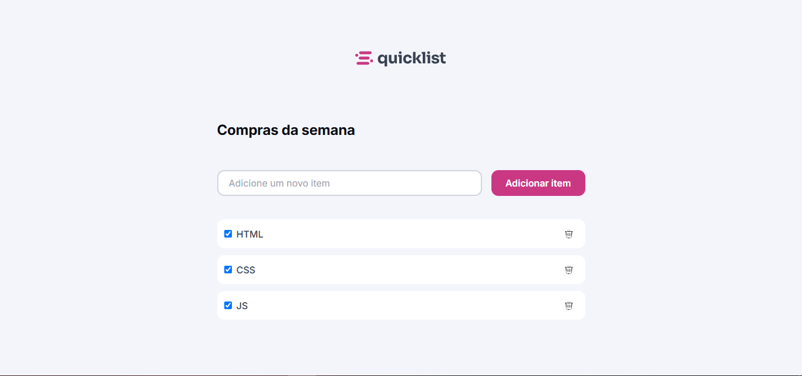

# Quicklist
Site de lista de compras, ele possibilita adicionar e remover itens, além de, permitir marcar como concluído / comprado  
Foram utilizados HTML e CSS para estilização e estruturação além do JS para a implementação da lógica e funcionalidades   

